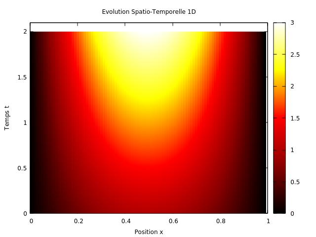
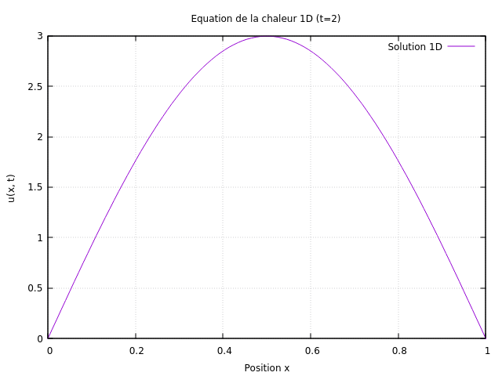
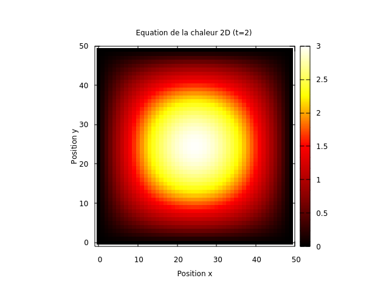

# High-Performance C++ Heat Equation Simulator

This project is a robust and high-performance C++ implementation of a numerical simulation for the 1D and 2D heat equation with convection. It was ported from an initial Python prototype to leverage the intrinsic advantages of C++ for scientific computing, focusing on execution speed, efficient memory management, and a modular, object-oriented architecture.

This work was completed as part of the S7 C++ course at Polytech Nice Sophia.

---

## Core Objectives

The transition from Python to C++ was driven by three main goals:

1.  **Performance:** Achieve a significant reduction in execution time, making the simulation viable for larger and more complex scenarios.
2.  **Resource Management:** Implement explicit memory management following the RAII (Resource Acquisition Is Initialization) principle to create an efficient and leak-free application.
3.  **Software Architecture:** Apply Object-Oriented Programming (OOP) principles to build a maintainable, extensible, and modular codebase, in contrast to a more script-like approach.

---

## Mathematical Model

The simulation solves the heat equation with an advection term, which describes how a quantity like temperature `u(x,t)` evolves over time and space due to diffusion and convection.

-   **1D Equation:** `∂u/∂t = D * ∂²u/∂x² - C * ∂u/∂x + f(x,t)`
-   **2D Equation:** `∂u/∂t = D * (∂²u/∂x² + ∂²u/∂y²) - Cx * ∂u/∂x - Cy * ∂u/∂y + f(x,y,t)`

The equations are solved numerically using the **Finite Difference Method** with an **Explicit Euler** scheme for time evolution, respecting the CFL condition for stability.

---

## Results & Visualizations

The C++ application is dedicated to high-performance computation. Visualization is decoupled and handled by **Gnuplot**, with communication managed via the `gnuplot-iostream` library.

### Core Simulation Outputs

The simulation accurately models the evolution of temperature in both 1D and 2D domains, respecting the Dirichlet boundary conditions. The final results are consistent with the analytical solution `u(x,t) = sin(πx)(1+t)`.

<table>
  <tr>
    <td align="center"><strong>1D Final State (t=2.0s)</strong></td>
    <td align="center"><strong>1D Spatio-Temporal Evolution</strong></td>
  </tr>
  <tr>
    <td></td>
    <td></td>
  </tr>
  <tr>
    <td align="center"><em>The final temperature profile along the 1D rod.</em></td>
    <td align="center"><em>The complete time history of the 1D simulation.</em></td>
  </tr>
  <tr>
    <td colspan="2" align="center"><strong>2D Final State (Heatmap at t=2.0s)</strong></td>
  </tr>
  <tr>
    <td colspan="2" align="center"></td>
  </tr>
  <tr>
    <td colspan="2" align="center"><em>The 2D heatmap shows a central hot spot, consistent with the physical model.</em></td>
  </tr>
</table>


---

## Software Architecture

The application is built on a modular, object-oriented design with a clear separation of concerns:

-   **`Mesh1D` / `Mesh2D`:** Encapsulate the spatial grid information (domain size, number of points, step size), isolating geometry management.
-   **`Solver` / `Solver2D`:** Contain the core simulation logic, including the time loop and the application of the numerical scheme.
-   **`parameters.hpp`:** Centralizes physical constants and simulation parameters using `constexpr` for compile-time optimizations.
-   **`boundary.hpp` / `source_term.hpp`:** Implement the physical aspects of the model (boundary conditions, source term) separately, allowing them to be modified without altering the solver logic.
-   **`main.cpp`:** Acts as the orchestrator, initializing objects, running the simulations, and managing the final visualization.

---

## Tech Stack

-   **Language:** C++17
-   **Libraries:**
    -   Boost (iostreams, system) for `gnuplot-iostream`
-   **Visualization:** Gnuplot
-   **Compiler:** g++

---

## Setup and Installation

### Prerequisites

-   A C++17 compatible compiler (e.g., `g++`)
-   **Gnuplot** must be installed and accessible in your system's PATH.
-   **Boost Libraries** (`iostreams`, `system`) must be installed.

### Project Structure

The repository follows this structure:

```
.
├── include/
│   ├── boundary.hpp
│   ├── gnuplot-iostream.h
│   ├── Mesh1D.hpp
│   ├── Mesh2D.hpp
│   ├── parameters.hpp
│   ├── solver.hpp
│   ├── solver2D.hpp
│   └── source_term.hpp
├── src/
│   ├── boundary.cpp
│   ├── main.cpp
│   ├── Mesh1D.cpp
│   ├── Mesh2D.cpp
│   ├── solver.cpp
│   └── solver2D.cpp
└── results/
    ├── figure2_solution_1d.png
    ├── figure3_evolution_1d.png
    └── figure4_heatmap_2d.png
```

### Compilation and Execution

1.  Navigate to the `src` directory:
    ```bash
    cd src
    ```

2.  Compile the project using the following command. This links all source files and necessary libraries.
    ```bash
    g++ -I../include/ -std=c++17 *.cpp -o programme -lboost_iostreams -lboost_system
    ```

3.  Run the simulation:
    ```bash
    ./programme
    ```

The program will execute the 1D and 2D simulations and generate the result plots using Gnuplot.
